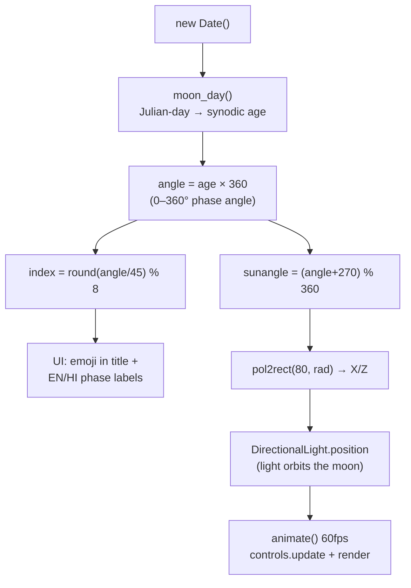

# Repository Guidelines

> Concise orientation for AI assistants working in this repo. Compiled from a parallel scout scan of the source, config, and assets.

## Project Overview

Moon-Phase-3D is a zero-backend, browser-based **3D visualization of tonight's Moon**, built with Three.js. It renders a textured lunar globe and positions a directional "sun" light at the astronomically correct angle for the current date, so the illuminated terminator on the sphere matches the real lunar phase. Bilingual English + Hindi/Devanagari phase labels and a phase emoji in the tab title are derived from the same computation.

**Critical constraint:** the phase is computed **once at page load** from `new Date()` — there is no date picker, slider, or reactivity. Changing the viewed date requires editing the date source and reloading.

## Architecture & Data Flow

Single-file app (`main.js`, ~195 lines, ESM). Everything runs at module top level except the `requestAnimationFrame` render loop.

**Key insight:** the phase is *not* shown by rotating the moon. The moon body is rotated a fixed 270° about Y (`main.js:177`); the visible terminator is entirely a function of where the directional light sits around the moon (radius 80). This is a physically-plausible illumination approach.

### Core algorithm: `moon_day()` (`main.js:30-82`)
Hand-rolled lunar-phase solver, no astronomy library:
1. `Date.prototype.getJulian` (`main.js:27-29`) — converts a date to a Julian Day Number.
2. Iterative loop (`main.js:65-78`) steps `F` backward through lunar cycles until the projected new moon precedes `thisJD`, applying `M5/M6/B6` sine perturbation corrections.
3. Returns a fractional lunar day = `(thisJD - oldJ) / 29.53059` (the synodic month).

### Phase → render wiring
- `main.js:83` `angle = moon_day(new Date()) * 360`
- `main.js:85` `index = round(angle/45) % 8` → buckets into 8 named phases (`moon_phases_en`, `moon_phases_hi`, `moon_phases_emoji`)
- `main.js:171-175` sun-angle placement via `pol2rect(80, radians)`
- `main.js:181-187` `animate()` — `requestAnimationFrame` loop, pure draw; phase is never recomputed

## Key Directories

| Path | Purpose |
|---|---|
| `main.js` | Sole application source — scene, phase math, UI, render loop |
| `index.html` | Vite entry; `<canvas id="bg">`, info/phase overlay, `<script type="module" src="/main.js">` |
| `style.css` | Styles + 4 `@font-face` declarations, glassmorphic UI, phase-label coloring |
| `assets/` | Moon textures (see inventory below) |
| `Fonts/` | 4 `.ttf` files (custom display fonts for EN/HI labels) |
| `public/` | Vite static dir (currently only an unused `vite.svg`) |
| `favicon.svg` | Custom brand favicon (magenta + lime) — **intentional, not scaffolding** |

### Asset inventory (`assets/`)
Only **3 of 6** textures are wired into `main.js`:

| File | Role | Status |
|---|---|---|
| `lroc_color_poles_2k.png` | NASA LROC color/albedo map — used as **both** `map` and `displacementMap` (`main.js:148-152`) | ✅ Active |
| `NormalMap.png` | Surface normal/bump map → `.normalMap` (`main.js:154`) | ✅ Active |
| `space.jpg` | Intended `scene.background` | ⚠️ Disabled (commented out, `main.js:178-179`) |
| `ldem_4_uint.png` | Lunar DEM heightmap — a more technically-correct displacement source | ❌ Unused |
| `moon_normal.jpg` + `.bak` | Superseded alternate normal map + manual backup | ❌ Unused |

**Note:** displacement currently reuses the *color* texture rather than a true heightmap; `ldem_4_uint.png` is the technically-correct alternative already present.

## Development Commands

Package manager: **npm** (lockfile v3). No test/lint/format/typecheck scripts exist.

| Command | Effect |
|---|---|
| `npm install` | Install deps (`three@^0.153.0`, `vite@^0.4.3.9`) |
| `npm run dev` | Vite dev server → http://localhost:5173 |
| `npm run build` | Production build → `dist/` |
| `npm run preview` | Serve the production build |
| `npm run host` | Dev server with `--host` (LAN-exposed) |

## Code Conventions & Common Patterns

- **Module system:** ESM end-to-end (`"type": "module"`, `<script type="module">`). Three.js imported via bare specifier (`import * as THREE from "three"`); `OrbitControls` via deep import `three/examples/jsm/controls/OrbitControls`.
- **State:** module-level globals (`var`/`const`/`let` at top level). No framework, no reactive store — the script mutates the DOM directly (`innerHTML`, `document.title`).
- **Async:** none meaningful. `TextureLoader().load(...)` is called synchronously without awaiting load; textures may pop in on first frame. No `async`/`await` in the codebase.
- **Error handling:** absent. No `try/catch`, no texture-load error callbacks. The phase solver assumes valid `Date` input.
- **Naming:** `snake_case` for app variables (`moon_phases_en`, `index_moon_phase_curr`), `camelCase` for functions (`moon_day`, `pol2rect`, `resetctrl`). Mixed convention — follow surrounding style in `main.js`.
- **DOM structure:** `index.html` carries minimal hooks — `#bg` canvas, `#info`/`#curr_phase_name` overlays, `#btn` reset button. JS builds the phase-label markup as an `innerHTML` string (`main.js:90-97`).
- **UI/CSS:** custom `@font-face` fonts; phase labels color-coded (`#english` yellow/lime, `#hindi` magenta). Universal box-sizing reset. Glassmorphic button.
- **Debug leftovers:** several `console.log` and commented-out lines throughout `main.js` (e.g. `main.js:88,98,113,180`). Treat as scratch, not load-bearing.

## Important Files

- **`main.js`** — the entire app. Key anchors:
  - `main.js:27-29` Julian-day conversion
  - `main.js:30-82` `moon_day()` phase solver (the algorithmic core)
  - `main.js:83-98` phase angle → UI update
  - `main.js:99-126` scene/camera/renderer/OrbitControls setup
  - `main.js:129-144` procedural 200-star starfield
  - `main.js:148-177` moon mesh + textures + sun-angle light placement
  - `main.js:181-193` render loop + reset-view handler
- **`package.json`** — manifest (`name: "threejsfinal"`, `private: true`). The only deps are `three` (runtime) and `vite` (dev).
- **`index.html`** — Vite entry; the single module script tag (`index.html:18`).
- **`README.md`** — thorough: features, install, how-it-works, a mermaid flowchart, and project-layout table. Reference it before editing.

## Runtime/Tooling Preferences

- **Runtime:** Node.js 18+ (per README). **Not** Bun — `package-lock.json` (lockfile v3) confirms npm.
- **Build tool:** Vite 4.3.9 on **default config** — there is **no** `vite.config.*`, `tsconfig`, `jsconfig`, ESLint, or Prettier file. Do not assume a config exists; Vite resolves everything from defaults.
- **Git LFS:** **not** used. `.gitattributes` contains only `* text=auto` (LF normalization). Large textures are committed as plain git blobs — be mindful of repo bloat when swapping assets.
- **Asset references:** textures use `./assets/...` and `assets/...` (mixed leading-slash). Fonts use a mix of absolute (`/Fonts/...`) and relative (`Fonts/...`) paths — inconsistent, keep one form when touching `style.css`.
- **Fonts caveat:** `style.css` references a `Belanosima` family for `#info` that has **no** `@font-face` declaration and ships no `.ttf` — it silently falls back to sans-serif.

## Testing & QA

- **No test framework, no test directory, no lint, no typecheck, no coverage tooling.** None of this is configured.
- **Verification = manual:** run `npm run dev`, open the page, and visually confirm the moon's terminator matches the real lunar phase for today, OrbitControls drag/zoom work, and the Reset View button (`#btn`) restores the camera.
- **Bake-in check:** to validate a phase-math change, you must reload the page (phase is computed once at load). There is no in-app date input to A/B test phases without editing source.

### Scaffolding leftovers (safe to remove, no runtime impact)
`sin cos.png`, `javascript.svg`, root `vite.svg`, `public/vite.svg`, `assets/moon_normal.jpg`, `assets/moon_normal.jpg.bak`, `assets/ldem_4_uint.png` (the last is intentional-but-unused — verify before deleting).
