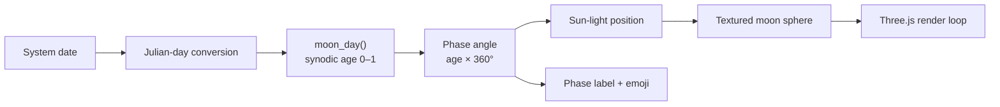

# Moon-Phase-3D


**A real-time, 3D visualization of tonight's Moon — rendered with the correct phase for the current date.**

Most "moon phase" widgets show a flat, abstract icon. Moon-Phase-3D instead renders a fully textured lunar globe with Three.js, then positions a directional "sun" light at the angle the Moon actually sits relative to the Sun today. The result is an interactive sphere whose illuminated terminator matches the real phase outside your window right now. Open it on any day and you see that day's Moon, with phase names shown in English and Hindi.

## ✨ Features

- **Phase-accurate lighting** — a Julian-day lunar algorithm computes today's synodic age (29.53059-day cycle) and aims a directional light so the rendered terminator is the live one.
- **NASA-grade surface detail** — the sphere is shaded with the LROC color-poles map plus normal and displacement maps for real craters and terrain relief.
- **Fully interactive 3D** — drag to orbit, scroll to zoom (Three.js `OrbitControls`), with a one-click *Reset View* button.
- **Bilingual phase labels** — current phase displayed in English and Hindi (Devanagari), and a matching phase emoji is appended to the browser tab title.
- **Starfield backdrop** — 200 procedurally placed emissive stars scattered across the scene.
- **Zero backend** — a single static front-end bundle; host it anywhere or just run it locally.

## 📦 Installation

Prerequisites: **[Node.js](https://nodejs.org/) 18+** and npm.

```bash
git clone https://github.com/<your-user>/Moon-Phase-3D.git
cd Moon-Phase-3D
npm install
```

`npm install` pulls in the only two dependencies declared in `package.json`: `three` (`^0.153.0`) and, as a dev dependency, `vite` (`^4.3.9`).

## 🚀 Usage

Start the Vite dev server:

```bash
npm run dev
```

Vite prints a local URL (default `http://localhost:5173`). Open it and you'll see the Moon rendered with tonight's phase, the phase name in English + Hindi, and a *Reset View* button. Drag to orbit, scroll to zoom.

Other scripts shipped in `package.json`:

```bash
npm run build      # production build → dist/
npm run preview    # serve the production build locally
npm run host       # dev server exposed on your LAN (--host)
```

## 🧱 How it works



1. **Phase math** — `main.js` converts the current date to a Julian day, then iterates a classic lunar-position series (sun/moon mean anomalies, latitude argument, and perturbation corrections) to find the most recent new moon and the current age within the 29.53059-day cycle.
2. **Sun angle** — the age maps to a 0–360° angle; a polar-to-rectangular conversion places the directional light so the lit/dark boundary on the sphere mirrors the real terminator.
3. **Rendering** — a 64-segment `SphereGeometry` is shaded with the LROC color texture (also used as a displacement map) and a normal map; 200 randomly placed star meshes sit behind it.
4. **Interaction** — `OrbitControls` drives camera orbit/zoom, and the *Reset View* button calls `controls.reset()`.

## ⚙️ Project layout

| Path | Purpose |
| --- | --- |
| `index.html` | Page shell, canvas, UI overlays |
| `main.js` | Phase calculation, Three.js scene, render loop |
| `style.css` | Overlays, fonts, buttons |
| `assets/` | LROC color map, normal/displacement maps, space texture |
| `Fonts/` | Saturday Moon, Khand, Yatra, Majestic display fonts |

## 🤝 Contributing

This is a small personal project. If you spot a bug or want to improve the phase accuracy, open an issue or pull request — keep changes scoped to `main.js` for logic and `assets/` for textures.

## 📄 License

No license file is present in this repository. Absent one, the code is **all rights reserved** by default; contact the repository owner before reusing it.
