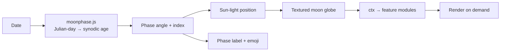

# Moon-Phase-3D


**🌐 Live demo: <https://moon-phase-3d.pages.dev>**

A real-time, interactive 3D visualization of the Moon — rendered with the **correct phase for any date**, built with Three.js + Vite.

Most "moon phase" widgets show a flat icon. Moon-Phase-3D renders a fully textured lunar globe and positions a directional "sun" light at the astronomically correct angle for the chosen date, so the illuminated terminator on the sphere matches the real Moon. Pick any date (or hit play and watch a full synodic cycle sweep by), drag to orbit, and read the phase in English and Hindi.

## ✨ Features

**Core**
- **Phase-accurate lighting** — a Julian-day lunar algorithm computes the synodic age (29.53059-day cycle) and aims the directional light so the rendered terminator is the real one.
- **NASA-grade surface** — LROC color-poles map + a normal map + LOLA DEM displacement for real craters and terrain relief.
- **Interactive 3D** — drag to orbit, scroll to zoom (`OrbitControls`), *Reset View* button.
- **Bilingual phase labels** — phase name in English and Hindi (Devanagari), plus a phase emoji in the tab title.
- **Starfield backdrop** — a procedural star layer (single `Points` draw call).
- **Render-on-demand** — the GPU only works when something changes (drag, date, resize), not 60×/sec.
- **Zero backend** — a static bundle; host it anywhere.

**Extra features** (hidden by default for a clean view — toggle with the **✨ Features** button)
- **Moon Data** card — illumination %, moon age, and the next new & full moon.
- **Time Controls** — ▶/⏸ play, speed (hour/day/week per second), reverse, and a ±1-year scrubber.
- **View Controls** — Northern/Southern hemisphere flip, shareable `#date=YYYY-MM-DD` URLs, and keyboard shortcuts.
- **Lunar Features** — Apollo landing sites and named maria/craters as pins with occlusion-aware labels.
- **Sky Map** — 53 bright catalog stars and 5 constellations (Orion, Big Dipper, Cassiopeia, Cygnus, Leo).
- **System View** — reveals the Sun and Earth and pulls the camera back so the phase *geometry* is obvious.

**Keyboard** (when not typing in a field): `←`/`→` step a day · `Space` play/pause · `R` reset view · `H` toggle hemisphere.

## 📦 Installation

Prerequisites: **[Node.js](https://nodejs.org/) 18+** and npm.

```bash
git clone https://github.com/bhoot1234567890/Moon-Phase-3D.git
cd Moon-Phase-3D
npm install
```

Dependencies: `three` (`^0.153.0`) and `vite` (`^4.3.9`, dev). That's it — tests use Node's built-in `node:test`, no test framework to install.

## 🚀 Usage

```bash
npm run dev       # Vite dev server → http://localhost:5173
npm run build     # production build → dist/
npm run preview   # serve the production build locally
npm run host      # dev server exposed on your LAN (--host)
npm test          # unit tests for the phase math (node:test)
```

## ☁️ Deploy (Cloudflare Pages)

The site is a static bundle — deploy `dist/` to Cloudflare Pages with the Wrangler CLI:

```bash
npm run build
npx wrangler pages deploy dist --project-name=moon-phase-3d --branch=main
```

Or the one-liner: `npm run deploy` (runs the build then deploys).

- **Project:** `moon-phase-3d`
- **Production URL:** <https://moon-phase-3d.pages.dev>
- First-time setup: `npx wrangler login`, then `npx wrangler pages project create moon-phase-3d --production-branch=main`.

## 🧱 How it works



- **Phase math** lives in `moonphase.js` — a pure, dependency-free module (`getJulian`, `moonDay`, `phaseAngle`, `phaseIndex`) that's unit-tested. It converts a date to a Julian day, iterates a classic lunar-position series to find the last new moon and the age within the cycle.
- **App context (`ctx`)** — `main.js` builds a shared context (scene refs, a single date source of truth, an event bus, render hooks) that every feature module builds against. Features never touch the scene directly.
- **Rendering** — a 64-segment sphere with LROC color + normal + DEM displacement; the directional light orbits the moon at radius 80 to set the phase. The frame only re-renders on demand.
- **Features** — each in `features/*.js` exports `init(ctx)`; the master toggle hides/shows them all.

## ⚙️ Project layout

| Path | Purpose |
| --- | --- |
| `index.html` | Page shell, canvas, UI overlays, toolbar |
| `main.js` | Scene setup, the `ctx` context, feature wiring |
| `moonphase.js` | Pure lunar-phase astronomy (unit-tested) |
| `calendar.js` | Custom on-brand date picker |
| `features/*.js` | Pluggable features (data panel, time, view, lunar, sky, system) |
| `style.css` | Overlays, fonts, buttons, toolbar |
| `vite.config.js` | Vendor chunk split, build target |
| `assets/` | LROC color map, normal map, LOLA DEM (WebP) |
| `Fonts/` | Subset WOFF2 display fonts (Saturday Moon, Khand, Yatra, Majestic) |

## 🤝 Contributing

Small personal project. Keep pure logic in `moonphase.js`, rendering/wiring in `main.js`, and self-contained features in `features/*.js` (each builds only against the `ctx` contract). Run `npm test` and `npm run build` before submitting.

## 📄 License

No license file is present. Absent one, the code is **all rights reserved** by default; contact the repository owner before reusing it. (Textures are NASA LRO/LOLA-derived; fonts retain their respective licenses.)
